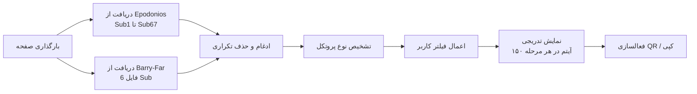

# 🌐 V2Ray Config Hub | مرجع پویای کانفیگ‌های پروکسی

[](LICENSE)
[](https://developer.mozilla.org/en-US/docs/Web/HTML)
[](https://developer.mozilla.org/en-US/docs/Web/JavaScript)
[](https://www.v2ray.com/)

> **یک داشبورد آنلاین و زیبا برای مشاهده، فیلتر، کپی و اسکن کانفیگ‌های V2Ray از منابع عمومی**  
> با قابلیت فیلتر رنگی، نمایش QR کد و بارگذاری تدریجی هوشمند

<p align="center">
  
  
  
  
</p>

---

## ✨ امکانات کلیدی

| قابلیت | توضیح |
|--------|--------|
| 🎨 **فیلتر رنگی بر اساس پروتکل** | نمایش کانفیگ‌های `vmess`، `vless`، `trojan` و `ss` با رنگ‌های متمایز |
| 📱 **QR کد زنده** | تبدیل هر کانفیگ به QR کد قابل اسکن توسط کلاینت‌های موبایل |
| 📋 **کپی یک‌کلیک** | کپی آدرس کامل کانفیگ با یک کلیک روی دکمه یا کل کارت |
| 🌓 **تم روشن/تاریک خودکار** | ذخیره تم انتخابی در مرورگر و رعایت سلیقه کاربر |
| 📊 **آمار لحظه‌ای** | نمایش تعداد کل، تعداد فیلتر شده و آخرین بروزرسانی |
| 🔄 **بارگذاری تدریجی (Pagination)** | افزایش سرعت بارگذاری اولیه و نمایش تدریجی کانفیگ‌ها |
| 📅 **تاریخ شمسی پویا** | نمایش تاریخ امروز به صورت فارسی (با استفاده از `Intl`) |
| ⚡ **منابع دوگانه** | ادغام خودکار از مخازن **Epodonios** و **Barry-Far** بدون تداخل |
| 🛡️ **مقاوم در برابر خطا** | در صورت عدم دسترسی به یک منبع، بقیه منابع بارگیری می‌شوند |

---

## 🚀 پروتکل‌های پشتیبانی شده

| پروتکل | آیکون | رنگ | نحوه تشخیص |
|--------|-------|------|-------------|
| **Vmess** | `fa-user-secret` | سبز لیمویی | شروع با `vmess://` |
| **Vless** | `fa-bolt` | نارنجی | شروع با `vless://` |
| **Trojan** | `fa-shield-haltered` | قرمز | شروع با `trojan://` |
| **SS / SSR** | `fa-key` | بنفش | شروع با `ss://` یا `shadowsocks://` |

---

## 🧠 معماری و نحوه عملکرد



### 📂 منابع داده (Hardcoded در کد)

| منبع | آدرس پایه | تعداد فایل‌ها |
|------|-----------|----------------|
| Epodonios | `https://raw.githubusercontent.com/Epodonios/v2ray-configs/main/` | 67 فایل `Sub1.txt` تا `Sub67.txt` |
| Barry-Far | `https://raw.githubusercontent.com/barry-far/V2ray-Config/main/` | 6 فایل شامل `All_Configs_Sub.txt` و `Sub1-5.txt` |

> **نکته امنیتی**: تمام درخواست‌ها از سمت کلاینت (مرورگر کاربر) ارسال می‌شود. نیازی به سرور واسط نیست.

---

## 🖥️ نصب و استفاده

### روش ۱: استفاده مستقیم از GitHub Pages (پیشنهادی)

1. مخزن را Fork یا Clone کنید:
```bash
git clone https://github.com/your-username/v2ray-config-hub.git
cd v2ray-config-hub
```

2. فایل `index.html` را در شاخه اصلی قرار دهید.

3. در تنظیمات مخزن، بخش **Pages** را فعال کنید (شاخه `main`).

4. با آدرس `https://your-username.github.io/v2ray-config-hub` به ابزار دسترسی خواهید داشت.

### روش ۲: اجرای لوکال (بدون سرور)

```bash
# فقط کافی است فایل index.html را در مرورگر باز کنید
open index.html   # در macOS
start index.html  # در Windows
xdg-open index.html # در Linux
```

> **توجه**: برخی مرورگرها ممکن است به دلیل CORS در فایل‌های لوکال محدودیت داشته باشند. برای بهترین عملکرد، از یک سرور محلی ساده استفاده کنید:
> ```bash
> npx http-server -p 8080
> # سپس به http://localhost:8080 مراجعه کنید
> ```

---

## 🎮 راهنمای استفاده

### 🖱️ تعامل با کانفیگ‌ها

| عمل | نحوه انجام |
|-----|-------------|
| **کپی کانفیگ** | کلیک روی دکمه `کپی` یا کلیک روی کل کارت (محتوای اصلی) |
| **نمایش QR** | کلیک روی دکمه `QR` |
| **فیلتر بر اساس پروتکل** | انتخاب از نوار دکمه‌های رنگی در بالای صفحه |
| **بارگذاری بیشتر** | اسکرول به پایین و کلیک روی دکمه `بارگذاری بیشتر` |
| **تغییر تم** | کلیک روی آیکون خورشید/ماه در کنار دکمه بروزرسانی |

### ⌨️ نکات پیشرفته

- هر بار کلیک روی **بروزرسانی**، داده‌ها دوباره از منابع دریافت می‌شوند (بدون نیاز به بازآوری صفحه).
- **QR کد** با کتابخانه `QRCode.js` در همان لحظه ساخته می‌شود و نیازی به سرور ندارد.
- کانفیگ‌های تکراری (بر اساس URL کامل) به صورت خودکار حذف می‌شوند.
- تعداد آیتم در هر بار بارگذاری: **۱۵۰ عدد** (قابل تغییر در متغیر `PAGE_SIZE`).

---

## 🎨 سفارشی‌سازی

### تغییر تعداد کانفیگ در هر مرحله
در فایل `index.html`، خط زیر را پیدا کنید:
```javascript
const PAGE_SIZE = 150;   // به هر عدد دلخواه تغییر دهید
```

### اضافه کردن منبع جدید
در آرایه `BARRY_FAR_URLS` یا تابع `fetchEpodonios` می‌توانید آدرس‌های جدید اضافه کنید:
```javascript
const BARRY_FAR_URLS = [
    "https://example.com/new-sub.txt",
    // ... آدرس‌های دیگر
];
```

### تغییر رنگ پروتکل‌ها
در بخش `<style>`، کلاس‌های مربوط به `.filter-btn[data-filter="vmess"]` را ویرایش کنید.

### شخصی‌سازی فواصل و اندازه کارت‌ها
متغیرهای CSS و مقادیر `padding`، `margin` و `border-radius` در همان بخش style قابل تغییر هستند.

---

## 📱 سازگاری با دستگاه‌ها

| دستگاه | وضعیت |
|---------|--------|
| 📱 موبایل (اندروید و iOS) | کاملاً واکنش‌گرا (استفاده از `grid` و `flex`) |
| 💻 دسکتاپ (ویندوز، لینوکس، مک) | عالی - با پشتیبانی از Hover Effects |
| 📟 تبلت | نمایش ۲ ستونه کانفیگ‌ها |
| 🖨️ پرینت | غیرفعال نیست - اما توصیه نمی‌شود |

---

## ⚠️ نکات مهم و رفع خطا

| خطای احتمالی | علت و راه‌حل |
|--------------|---------------|
| `QR code not generated` | مطمئن شوید فایل `qrcode.min.js` به درستی لود شده است (CDN در شبکه شما باز باشد). |
| `Failed to fetch` | بعضی از مخازن GitHub ممکن است محدودیت Rate Limit داشته باشند. چند ثانیه صبر کنید و دوباره کلیک کنید. |
| `No configs found` | اگر هیچ کانفیگی نمایش داده نشد، احتمالاً ساختار فایل‌های منبع تغییر کرده است. Issue بدهید. |
| `آیکون‌ها نمایش داده نمی‌شوند` | CDN فونت‌آوسم را تغییر دهید یا از آینه داخلی استفاده کنید. |

---

## 🛠️ وابستگی‌ها (Dependencies)

کتابخانه‌های خارجی استفاده شده (تمامی از طریق CDN):

| نام | نسخه | کاربرد |
|------|-------|---------|
| [Font Awesome](https://fontawesome.com/) | 6.0.0-beta3 | آیکون‌های حرفه‌ای |
| [QRCode.js](https://github.com/davidshimjs/qrcodejs) | 1.0.0 | تولید QR کد در مرورگر |
| [Vazirmatn](https://github.com/rastikerdar/vazirmatn) | v33.003 | فونت فارسی زیبا و خوانا |

**نیاز به نصب هیچ بسته‌ای نیست** 🎉

---

## 🤝 مشارکت در توسعه

پیشنهادات و Pull Request‌ها با آغوش باز پذیرفته می‌شوند. لطفاً قبل از اقدام، موارد زیر را رعایت کنید:

1. مخزن را **Fork** کنید.
2. یک **برچسب (tag)** جدید برای تغییرات خود ایجاد کنید.
3. کد را در مرورگرهای مختلف (به خصوص موبایل) تست کنید.
4. Pull Request خود را با توضیح کامل ارسال کنید.

---

## 📜 مجوز

این پروژه تحت مجوز **MIT** منتشر شده است. استفاده تجاری و غیرتجاری آزاد است فقط کافی است attribution را حفظ کنید.

---

## 🌟 ستاره فراموش نشه!

اگر این پروژه برایت مفید بود، خوشحال می‌شوم یک **🌟 ستاره** به این مخزن بدی.  
این کار به دیده شدن پروژه و تشویق به توسعه کمک می‌کند.

---

## 📞 ارتباط

- **پشتیبانی و گزارش باگ**: [Issues](https://github.com/your-username/v2ray-config-hub/issues)

---

<p align="center">
  ساخته شده با ❤️ برای جامعه آزاد اینترنت  
  <br />
  <strong>کانفیگ‌ها فقط برای تست و یادگیری هستند. لطفاً قوانین محلی خود را رعایت کنید.</strong>
</p>
